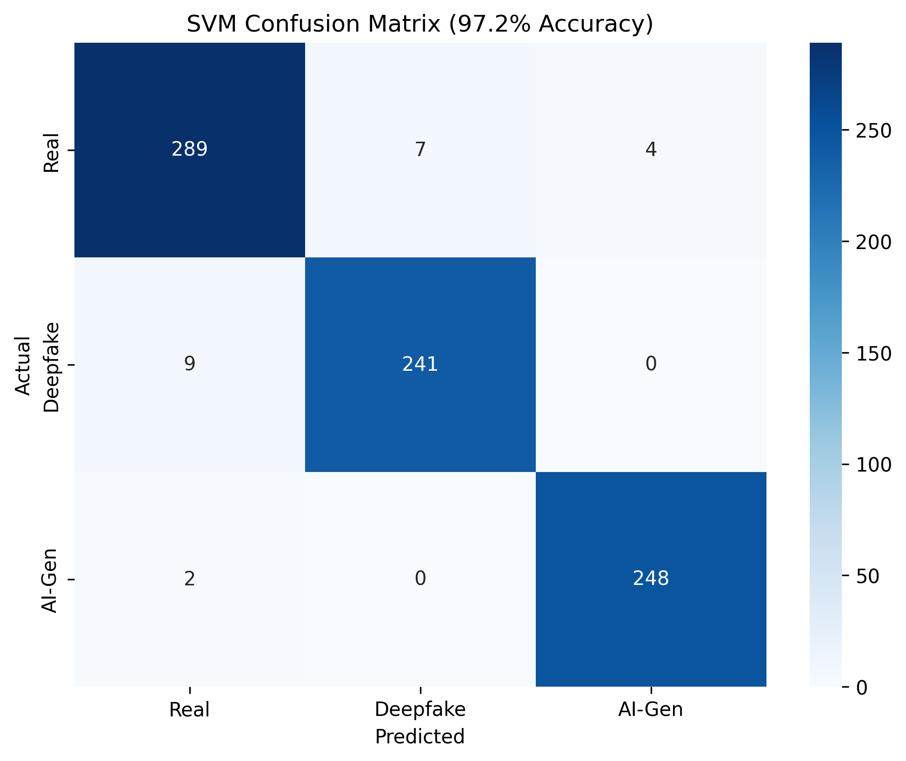

# Deepfake & AI-Generated Face Detection

A **3-class image classifier** that distinguishes between **Real**, **Deepfake**, and **AI-Generated** faces using a dual-branch feature extractor combining spatial (RGB) and frequency (FFT) information, followed by an SVM classifier.



---

## Project Overview

| Property | Value |
|----------|-------|
| **Institution** | Sree Chitra Thirunal College of Engineering (SCTCE) |
| **Course** | B.Tech CSE — AI & ML Specialization |
| **Project Type** | Mini-project |
| **Date** | February 2026 |

**Problem statement:** With the rise of generative AI, distinguishing real faces from deepfakes and AI-synthesized faces is increasingly difficult for humans. This project builds a lightweight, interpretable classifier that handles all three categories simultaneously.

---

## Architecture

The pipeline has two stages: a **frozen feature extractor** (no training), and a trained **SVM classifier**.

```
Input Image (any size)
        |
   [MTCNN Face Detection]  ← detects & crops face with 20px padding
        |
  224 × 224 × 3 crop
        |
        +──────────────────────────+
        |                          |
  [RGB Branch]               [FFT Branch]
        |                          |
 EfficientNet-B0           Grayscale conversion
  (pretrained,              → 2D FFT magnitude
   frozen weights)          → log1p scaling
        |                    → 8×8 adaptive avg pool
  1280-dim vector                  |
                             64-dim vector
        |                          |
        +────────── concat ────────+
                       |
                 1344-dim vector
                       |
               [StandardScaler]
                       |
              [PCA: 1344 → 100]
                       |
              [SVM: RBF, C=1.0]
               class_weight=balanced
                       |
          Real / Deepfake / AI-Generated
```

### Why dual-branch?

- **RGB branch (EfficientNet-B0):** Captures spatial artifacts — blurring, texture inconsistencies, and blending seams common in deepfakes.
- **FFT branch:** Captures frequency-domain artifacts — GAN-generated faces often leave periodic patterns in the frequency spectrum that are invisible to the naked eye.
- **Frozen weights:** EfficientNet is used as a feature extractor only (ImageNet pretrained). No fine-tuning — keeps training fast and avoids overfitting on the small dataset.

### Why SVM over a full neural network?

- Dataset is small (~800 images). A deep classifier would overfit badly.
- SVM with an RBF kernel generalizes well on compact, PCA-reduced feature vectors.
- Faster training (~30 sec vs ~10 min for MLP), no GPU needed at inference.
- Course requirement: classical ML classifier on top of learned features.

---

## Dataset

| Class | Count | Source |
|-------|-------|--------|
| **Real** | 300 | DFGC 2021 (250) + Nyakura dataset (50) |
| **Deepfake** | 250 | DFGC 2021 fake_baseline |
| **AI-Generated** | 250 | Nyakura (50) + thispersondoesnotexist.com (200) |
| **Total** | **800** | Mixed sources |

All images were preprocessed with **MTCNN** (Multi-task Cascaded CNN) to detect and crop faces before training, ensuring the model learns from face regions only.

**Train / Val / Test split:** 70% / 15% / 15% — stratified by class (each split has proportional class representation).

---

## Results

### Honest Evaluation (held-out test set, never seen during training)

| Metric | Value |
|--------|-------|
| **Train Accuracy** | 92.5% |
| **Validation Accuracy** | 81.7% |
| **Test Accuracy** | 80.0% |
| **Overfit Gap (train − test)** | 12.5% |
| **5-fold CV Mean** | 81.2% ± 2.0% |

### Per-class performance (test set)

| Class | Precision | Recall | Notes |
|-------|-----------|--------|-------|
| Real | 0.80 | 0.62 | Harder to separate from high-quality deepfakes |
| Deepfake | 0.74 | 0.82 | Good recall — most fakes caught |
| AI-Generated | 0.86 | 1.00 | Distinctive frequency signature makes this easiest |

**Observation:** AI-generated faces (from GANs/diffusion) leave strong FFT artifacts. Deepfakes are harder to classify correctly because they are built on real faces with localized edits.

### What changed from the original v2.0 "97.2%" figure

That figure was measured by running `evaluate_svm.py` on the entire dataset — including training samples. It was not a valid generalization metric. v3.0 fixes:

1. Feature extraction in `eval` mode — no augmentation during extraction
2. 70/15/15 stratified split — held-out test set
3. PCA (1344 → 100) — prevents RBF-SVM from memorizing high-dimensional noise
4. SVM `C` reduced from 10 → 1.0 — wider decision boundary, better generalization
5. 5-fold cross-validation — independent estimate before touching the test set

---

## Explainability — Grad-CAM

Grad-CAM hooks are registered on EfficientNet's `_conv_head` layer. The heatmap shows which spatial regions of the face the model weighted most heavily when making its decision.

Typical patterns observed:
- **Real:** Diffuse attention across the whole face
- **Deepfake:** Strong focus on eye region, jaw line, and blending boundaries
- **AI-Generated:** Attention often highlights background and hair (GAN artifacts)

---

## Project Structure

```
mini_project/
├── svm_model/                  ← Main model (active pipeline)
│   ├── app.py                  ← Streamlit web UI (entry point)
│   ├── inference.py            ← predict_image() + generate_gradcam()
│   ├── train_svm.py            ← FeatureExtractor class + training script
│   ├── evaluate_svm.py         ← Confusion matrix + per-class report
│   ├── predict_svm.py          ← CLI: single image prediction
│   ├── gradcam_svm.py          ← CLI: Grad-CAM visualization
│   └── README.md
│
├── dataset/
│   ├── cropped_dataset/        ← MTCNN-preprocessed face images
│   │   ├── real/               (300 images)
│   │   ├── deepfake/           (250 images)
│   │   └── ai_gen/             (250 images)
│   ├── mtcnn_preprocessing.py  ← Face detection + crop pipeline
│   └── download_aigen.py       ← Script used to scrape AI-gen faces
│
├── augmentdatting.py           ← BalancedFaceDataset (train/eval modes)
├── requirements.txt
├── Dockerfile
└── README.md
```

**Inference dependency chain:**
`app.py` → `inference.py` → `train_svm.py` (FeatureExtractor) → pretrained weights

### Saved model files (after training)

| File | Contents |
|------|----------|
| `svm_model/feature_extractor.pth` | Frozen EfficientNet-B0 weights |
| `svm_model/scaler.joblib` | Fitted StandardScaler |
| `svm_model/pca.joblib` | Fitted PCA (1344 → 100) |
| `svm_model/svm_model.joblib` | Trained SVM classifier |

---

## How to Run

### Install dependencies

```bash
pip install -r requirements.txt
pip install streamlit
```

### Option 1: Streamlit Web UI

```bash
cd svm_model
streamlit run app.py
```

Upload any face image. The app:
1. Detects and crops the face using MTCNN
2. Extracts EfficientNet + FFT features
3. Runs the SVM classifier
4. Displays predicted class, confidence scores, and Grad-CAM overlay — all in one view

### Option 2: CLI — single image prediction

```bash
cd svm_model
python predict_svm.py path/to/image.jpg
```

### Option 3: CLI — Grad-CAM visualization

```bash
cd svm_model
python gradcam_svm.py path/to/image.jpg
```

Saves `gradcam_svm_result.png` (4-panel: input → face crop → heatmap → overlay).

### Option 4: Retrain from scratch

```bash
cd svm_model
python train_svm.py       # extracts features, trains SVM, saves model files
python evaluate_svm.py    # generates confusion matrix
```

### Option 5: Docker

```bash
docker build -t deepfake-detector .
docker run -v ${PWD}:/app deepfake-detector python svm_model/train_svm.py
```

---

## Acknowledgements

**Dataset sources:**
- DFGC 2021 — Deepfake Game Competition (IJCB 2021)
- Nyakura AI_Human_Face_Detection — Hugging Face
- thispersondoesnotexist.com — StyleGAN2-generated faces

**Libraries:**
- PyTorch, EfficientNet-PyTorch — feature extraction backbone
- scikit-learn — SVM, PCA, StandardScaler
- facenet-pytorch (MTCNN) — face detection
- Streamlit — web UI
- OpenCV, Albumentations, Pillow — image processing

---

## License

Educational purposes only. Deepfake detection research involves sensitive data — users should be aware of the ethical implications of this technology.

---

*Last updated: May 2026*
