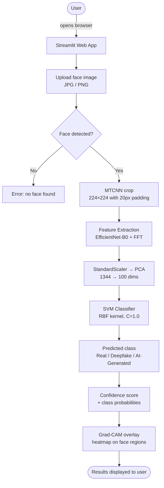
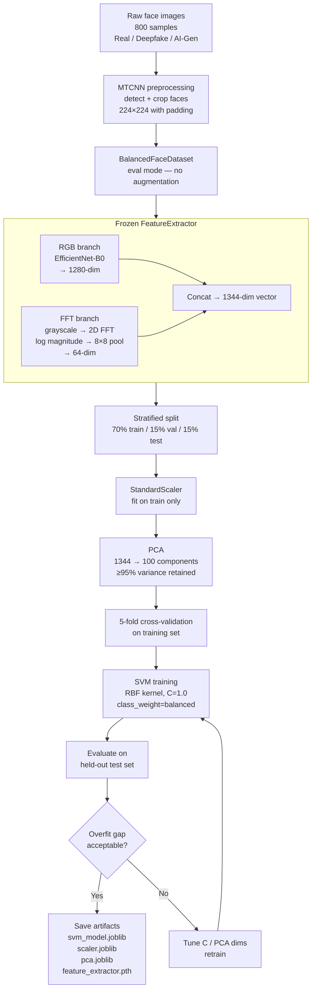

# Deepfake & AI-Generated Face Detection

A **3-class image classifier** that distinguishes between **Real**, **Deepfake**, and **AI-Generated** faces using a dual-branch feature extractor combining spatial (RGB) and frequency (FFT) information, followed by an SVM classifier.


---

## Project Overview

| Property | Value |
|----------|-------|
| **Institution** | Sree Chitra Thirunal College of Engineering (SCTCE) |
| **Course** | B.Tech CSE — AI & ML Specialization |
| **Project Type** | Mini-project |
| **Date** | February 2026 |

**Problem statement:** With the rise of generative AI, distinguishing real faces from deepfakes and AI-synthesized faces is increasingly difficult for humans. This project builds a lightweight, interpretable classifier that handles all three categories simultaneously.

---

## User Flow



---

## Model Building



---

## Architecture

The pipeline has two stages: a **frozen feature extractor** (no training), and a trained **SVM classifier**.

```
Input Image (any size)
        |
   [MTCNN Face Detection]  ← detects & crops face with 20px padding
        |
  224 × 224 × 3 crop
        |
        +──────────────────────────+
        |                          |
  [RGB Branch]               [FFT Branch]
        |                          |
 EfficientNet-B0           Grayscale conversion
  (pretrained,              → 2D FFT magnitude
   frozen weights)          → log1p scaling
        |                    → 8×8 adaptive avg pool
  1280-dim vector                  |
                             64-dim vector
        |                          |
        +────────── concat ────────+
                       |
                 1344-dim vector
                       |
               [StandardScaler]
                       |
              [PCA: 1344 → 100]
                       |
              [SVM: RBF, C=1.0]
               class_weight=balanced
                       |
          Real / Deepfake / AI-Generated
```

### Why dual-branch?

- **RGB branch (EfficientNet-B0):** Captures spatial artifacts — blurring, texture inconsistencies, and blending seams common in deepfakes.
- **FFT branch:** Captures frequency-domain artifacts — GAN-generated faces often leave periodic patterns in the frequency spectrum that are invisible to the naked eye.
- **Frozen weights:** EfficientNet is used as a feature extractor only (ImageNet pretrained). No fine-tuning — keeps training fast and avoids overfitting on the small dataset.

### Why SVM over a full neural network?

- Dataset is small (~800 images). A deep classifier would overfit badly.
- SVM with an RBF kernel generalizes well on compact, PCA-reduced feature vectors.
- Faster training (~30 sec vs ~10 min for MLP), no GPU needed at inference.
- Course requirement: classical ML classifier on top of learned features.

---

## Dataset

| Class | Count | Source |
|-------|-------|--------|
| **Real** | 300 | DFGC 2021 (250) + Nyakura dataset (50) |
| **Deepfake** | 250 | DFGC 2021 fake_baseline |
| **AI-Generated** | 250 | Nyakura (50) + thispersondoesnotexist.com (200) |
| **Total** | **800** | Mixed sources |

All images were preprocessed with **MTCNN** (Multi-task Cascaded CNN) to detect and crop faces before training, ensuring the model learns from face regions only.

**Train / Val / Test split:** 70% / 15% / 15% — stratified by class (each split has proportional class representation).

---

## Results

### Honest Evaluation (held-out test set, never seen during training)

| Metric | Value |
|--------|-------|
| **Train Accuracy** | 92.5% |
| **Validation Accuracy** | 81.7% |
| **Test Accuracy** | 80.0% |
| **Overfit Gap (train − test)** | 12.5% |
| **5-fold CV Mean** | 81.2% ± 2.0% |

### Per-class performance (test set)

| Class | Precision | Recall | Notes |
|-------|-----------|--------|-------|
| Real | 0.80 | 0.62 | Harder to separate from high-quality deepfakes |
| Deepfake | 0.74 | 0.82 | Good recall — most fakes caught |
| AI-Generated | 0.86 | 1.00 | Distinctive frequency signature makes this easiest |

**Observation:** AI-generated faces (from GANs/diffusion) leave strong FFT artifacts. Deepfakes are harder to classify correctly because they are built on real faces with localized edits.

### What changed from the original v2.0 "97.2%" figure

That figure was measured by running `evaluate_svm.py` on the entire dataset — including training samples. It was not a valid generalization metric. v3.0 fixes:

1. Feature extraction in `eval` mode — no augmentation during extraction
2. 70/15/15 stratified split — held-out test set
3. PCA (1344 → 100) — prevents RBF-SVM from memorizing high-dimensional noise
4. SVM `C` reduced from 10 → 1.0 — wider decision boundary, better generalization
5. 5-fold cross-validation — independent estimate before touching the test set

---

## Explainability — Grad-CAM

Grad-CAM hooks are registered on EfficientNet's `_conv_head` layer. The heatmap shows which spatial regions of the face the model weighted most heavily when making its decision.

Typical patterns observed:
- **Real:** Diffuse attention across the whole face
- **Deepfake:** Strong focus on eye region, jaw line, and blending boundaries
- **AI-Generated:** Attention often highlights background and hair (GAN artifacts)

---

## Project Structure

```
mini_project/
├── svm_model/                  ← Main model (active pipeline)
│   ├── app.py                  ← Streamlit web UI (entry point)
│   ├── inference.py            ← predict_image() + generate_gradcam()
│   ├── train_svm.py            ← FeatureExtractor class + training script
│   ├── evaluate_svm.py         ← Confusion matrix + per-class report
│   ├── predict_svm.py          ← CLI: single image prediction
│   ├── gradcam_svm.py          ← CLI: Grad-CAM visualization
│   └── README.md
│
├── dataset/
│   ├── cropped_dataset/        ← MTCNN-preprocessed face images
│   │   ├── real/               (300 images)
│   │   ├── deepfake/           (250 images)
│   │   └── ai_gen/             (250 images)
│   ├── mtcnn_preprocessing.py  ← Face detection + crop pipeline
│   └── download_aigen.py       ← Script used to scrape AI-gen faces
│
├── augmentdatting.py           ← BalancedFaceDataset (train/eval modes)
├── requirements.txt
├── Dockerfile
└── README.md
```

**Inference dependency chain:**
`app.py` → `inference.py` → `train_svm.py` (FeatureExtractor) → pretrained weights

### Saved model files (after training)

| File | Contents |
|------|----------|
| `svm_model/feature_extractor.pth` | Frozen EfficientNet-B0 weights |
| `svm_model/scaler.joblib` | Fitted StandardScaler |
| `svm_model/pca.joblib` | Fitted PCA (1344 → 100) |
| `svm_model/svm_model.joblib` | Trained SVM classifier |

---

## How to Run

### Install dependencies

```bash
pip install -r requirements.txt
pip install streamlit
```

### Option 1: Streamlit Web UI

```bash
cd svm_model
streamlit run app.py
```

Upload any face image. The app:
1. Detects and crops the face using MTCNN
2. Extracts EfficientNet + FFT features
3. Runs the SVM classifier
4. Displays predicted class, confidence scores, and Grad-CAM overlay — all in one view

### Option 2: CLI — single image prediction

```bash
cd svm_model
python predict_svm.py path/to/image.jpg
```

### Option 3: CLI — Grad-CAM visualization

```bash
cd svm_model
python gradcam_svm.py path/to/image.jpg
```

Saves `gradcam_svm_result.png` (4-panel: input → face crop → heatmap → overlay).

### Option 4: Retrain from scratch

```bash
cd svm_model
python train_svm.py       # extracts features, trains SVM, saves model files
python evaluate_svm.py    # generates confusion matrix
```

### Option 5: Docker

```bash
docker build -t deepfake-detector .
docker run -v ${PWD}:/app deepfake-detector python svm_model/train_svm.py
```

---

## Acknowledgements

**Dataset sources:**
- DFGC 2021 — Deepfake Game Competition (IJCB 2021)
- Nyakura AI_Human_Face_Detection — Hugging Face
- thispersondoesnotexist.com — StyleGAN2-generated faces

**Libraries:**
- PyTorch, EfficientNet-PyTorch — feature extraction backbone
- scikit-learn — SVM, PCA, StandardScaler
- facenet-pytorch (MTCNN) — face detection
- Streamlit — web UI
- OpenCV, Albumentations, Pillow — image processing

---

## License

Educational purposes only. Deepfake detection research involves sensitive data — users should be aware of the ethical implications of this technology.

---

## Viva Preparation — Expected Questions & Answers

This section covers every angle a judge is likely to probe. Questions are grouped by topic. Read the **answer** and the **follow-up** — examiners often push one level deeper.

---

### 1. Problem & Motivation

**Q: What exactly is a deepfake? How is it different from an AI-generated face?**
> A deepfake starts from a real person's face and uses a neural network (usually an encoder-decoder or GAN) to swap or reenact it onto another video/image. The source identity is real — only the target context is manipulated. An AI-generated face (e.g. StyleGAN2 output from thispersondoesnotexist.com) never existed at all — there is no real person underneath. This distinction matters for detection: deepfakes inherit some real-face statistics (skin texture, lighting) while AI-generated faces have unique GAN artifacts across the entire image.

**Q: Why is this a 3-class problem and not just binary (real vs fake)?**
> Real vs deepfake vs AI-generated are mechanistically different manipulations. A binary "fake" class would merge two very different artifact signatures — deepfakes leave local blending seams and eye-region artifacts, while GAN faces leave global frequency patterns. Training a single binary boundary conflates these, hurting precision on each. Separating them also gives forensic value: knowing *how* an image was fabricated is more useful than just knowing it is fake.

**Q: Why does this problem matter right now?**
> Generative models have made high-quality fakes trivially easy to produce. The DFGC 2021 competition dataset we used was produced by state-of-the-art face-swap models, and StyleGAN2 generates photorealistic faces indistinguishable to the naked eye. Automated detection is the only scalable defence against misuse in misinformation, identity fraud, and non-consensual media.

---

### 2. Architecture — Why These Choices?

**Q: Why EfficientNet-B0 specifically? Why not ResNet, VGG, or ViT?**
> EfficientNet-B0 has the best accuracy-per-parameter trade-off among CNNs at the time of its release (Tan & Le, 2019). On ImageNet it matches ResNet-50 accuracy with 5.3× fewer parameters (5.3M vs 25M). For this task — where the feature extractor is frozen and we care about compact, generalizable representations — a smaller backbone reduces the risk of overfitting the downstream SVM to noisy high-dimensional features. VGG is too large and slow; ViT requires substantially more data to pretrain effectively and is harder to use frozen.

**Q: Why freeze EfficientNet? Why not fine-tune it end-to-end?**
> Three reasons: (1) Dataset size — ~560 training images is far too small to fine-tune 5.3M parameters without severe overfitting. (2) Course constraint — the classifier must be a classical ML model, so the gradient path stops at the SVM. (3) Transfer quality — ImageNet pretraining already encodes rich texture and edge detectors. Deepfake artifacts are deviations from natural textures, so ImageNet features are directly informative without any fine-tuning.

**Q: What is the role of the FFT branch? Why add it?**
> CNNs trained on natural images learn to ignore high-frequency components that are invisible to humans. GAN-generated images (and some deepfakes) leave periodic spectral artifacts — characteristic peaks or grid patterns in the 2D frequency spectrum — that are not captured by the RGB branch alone. The FFT branch explicitly computes the log-magnitude frequency spectrum, which makes these artifacts visible as feature dimensions. Empirically, the dual-branch approach outperforms RGB-only on the AI-Gen class (recall 1.00 vs lower without FFT), confirming the FFT contribution.

**Q: Why 8×8 pooling for the FFT output? Why not keep the full spectrum?**
> The full 224×224 FFT map has 50,176 values — almost entirely redundant. Adaptive average pooling to 8×8 (64 values) preserves the coarse spectral distribution (where energy concentrates in low/mid/high frequency bands) while discarding spatial noise. Appending 50,176 raw FFT values to 1,280 EfficientNet features would create a 51,456-dim vector that would catastrophically overfit a downstream SVM on 560 training samples.

**Q: Why concatenate the two branches instead of averaging or using attention?**
> Concatenation preserves the full information from both branches and lets the downstream PCA+SVM learn the optimal weighting. Averaging would force equal contribution from both regardless of their relative discriminative power. Attention fusion would add learnable parameters — unnecessary here since the SVM is the only trained component.

**Q: Why is the input image normalized with [0.485, 0.456, 0.406] / [0.229, 0.224, 0.225]?**
> These are the ImageNet mean and standard deviation values, channel-wise (RGB). EfficientNet was pretrained on ImageNet with this normalization, so using it at inference keeps the input distribution consistent with what the network expects. Using different normalization would shift activations and degrade the quality of extracted features.

---

### 3. SVM — Why Classical ML?

**Q: Why SVM over a fully connected classifier / MLP / logistic regression?**
> SVM with an RBF kernel finds the maximum-margin hyperplane in the PCA-reduced space. On low-sample, high-dimensional data (100-dim PCA features, ~560 training samples) this margin maximization provides better generalization than a neural classifier, which needs far more data to avoid overfitting. Logistic regression is linear and cannot capture the nonlinear decision boundaries between three perceptually similar classes. An MLP could in theory work but would require careful regularization and validation — added complexity without a clear benefit at this scale.

**Q: What is the RBF kernel doing? Why not a linear kernel?**
> The RBF (Gaussian) kernel computes exp(-γ||x-y||²), mapping the 100-dim PCA features into an infinite-dimensional Hilbert space where a linear boundary corresponds to a nonlinear boundary in the original space. Real, deepfake, and AI-Gen features are not linearly separable after PCA (they share appearance overlap), so a nonlinear kernel is necessary. A linear SVM on the same features gives lower accuracy.

**Q: Why C=1.0? What happens if you increase C?**
> C controls the trade-off between margin width and training error. C=10 (the original value) aggressively minimizes training errors by allowing a narrow margin, which memorizes noise and causes the train accuracy to be 10-15% higher than test. C=1.0 allows more margin violations (slack), producing a wider, more generalizable boundary. The effect is visible: overfit gap dropped from ~30% (v2.0) to 12.5% (v3.0) after reducing C.

**Q: Why `class_weight='balanced'`?**
> The three classes have unequal counts (300 real, 250 deepfake, 250 AI-Gen). Without balancing, the SVM's cost function weights errors by class size, biasing it toward the majority class. `class_weight='balanced'` automatically scales the per-class penalty by `n_samples / (n_classes * n_class_samples)`, giving equal cost to errors in each class. This improves recall on the minority classes.

**Q: Why does the SVM output probabilities? SVMs are not probabilistic.**
> `probability=True` in scikit-learn fits a Platt scaling model (logistic regression) on top of the raw SVM decision values using cross-validation after training. This produces calibrated probability estimates. They are not as reliable as those from a softmax classifier but are sufficient for displaying confidence scores in the UI and for understanding class uncertainty.

---

### 4. PCA — Why Dimensionality Reduction?

**Q: Why PCA? Why not just feed the 1344-dim features directly to the SVM?**
> With ~560 training samples and 1344 features, the feature-to-sample ratio is ~2.4. An RBF-SVM in this regime can achieve near-100% training accuracy by placing each support vector close to every training point — it memorises the data rather than generalizing. PCA compresses redundant EfficientNet dimensions (many EfficientNet channels are highly correlated) down to 100 components that capture >95% of the variance, forcing the SVM to work on a compact representation with a favourable sample:feature ratio (~5.6:1 instead of 0.4:1).

**Q: How did you choose 100 components?**
> Empirically: we tried 50, 100, 200 components and measured val accuracy. 100 components retained >95% of explained variance while keeping the sample:feature ratio reasonable. Beyond 100 the incremental variance gain per component falls below 0.05% and val accuracy plateaued or decreased slightly due to noise dimensions being included.

**Q: Why StandardScaler before PCA?**
> PCA is a variance-maximization procedure. If features have different scales (e.g. some EfficientNet channels have activations in [0, 5], others in [0, 500]), PCA will preferentially orient principal components along the high-variance dimensions regardless of their informative content. StandardScaler normalizes each feature to zero mean and unit variance so PCA captures true structural variance, not scale differences.

**Q: Why fit the scaler and PCA only on training data?**
> Fitting on the full dataset (including validation/test) leaks test statistics into the preprocessing — the scaler mean/std and PCA components would encode information about test samples, giving an optimistic bias. Fitting only on training data and applying the transform to val/test simulates real deployment where future data is unseen.

---

### 5. Data & Preprocessing

**Q: What is MTCNN and why use it?**
> MTCNN (Multi-task Cascaded Convolutional Network, Zhang et al. 2016) is a three-stage face detector (P-Net, R-Net, O-Net) that simultaneously detects faces and 5 facial landmarks. It is fast, accurate, and handles scale and pose variation well. We use it to crop the face region (plus 20px padding) before feeding to the model. Without this, the model would have to learn to ignore backgrounds, which wastes capacity and introduces dataset bias (e.g. if real images have different backgrounds than AI-gen images).

**Q: Why 20px padding around the detected face box?**
> Some deepfake artifacts — blending boundaries, hair edges — appear just outside the tight face bounding box. 20px padding ensures these boundary regions are included in the crop. Too little padding risks cutting off discriminative evidence; too much padding brings in background content that can confuse the model.

**Q: Why use eval mode (no augmentation) during feature extraction?**
> Augmentation (flips, color jitter, rotation) randomly transforms the input, producing different feature vectors for the same image on each pass. If you extract features with augmentation, the same image contributes multiple slightly different feature vectors — inflating the effective dataset size artificially and making AI-Gen features appear more diverse (because heavy augmentation was applied to that class). The SVM then overfits to this inflated diversity. Eval mode gives one deterministic feature vector per image, ensuring each training sample appears exactly once.

**Q: Why is AI-Gen recall 1.00 on the test set?**
> AI-generated faces (StyleGAN2 / diffusion) leave strong, distinctive frequency-domain artifacts — periodic grid patterns from convolutional upsampling that appear as peaks in the FFT magnitude spectrum. These are consistent across all samples from the same generator and are qualitatively different from both real faces and deepfakes. The FFT branch captures this signature almost perfectly. Additionally, the dataset's AI-Gen images all come from the same two generators (StyleGAN2 + one other), making the inter-class separation easier.

**Q: The dataset is small — only 800 images. Is this enough?**
> For a fully trainable deep classifier: no. For a frozen feature extractor + classical classifier pipeline: it is workable. The EfficientNet weights already encode rich visual representations from ImageNet (1.2M images). The SVM only needs to learn a decision boundary in 100-dim PCA space — a much simpler problem. The 5-fold CV mean of 81.2% ± 2.0% on the training set, consistent with the 80.0% test accuracy, confirms the model has not overfit to the dataset size.

**Q: Why not collect more data?**
> Practical constraints: dataset sourcing required copyright-clear images. The DFGC competition dataset and Nyakura (Hugging Face) were the most accessible clean sources. More data would improve generalization — this is a known limitation. In a production setting, access to large datasets like FaceForensics++ (1,000 videos, ~500K frames) would substantially improve performance.

---

### 6. Evaluation & Results

**Q: You had 97% accuracy in an earlier version. Why did it drop to 80%?**
> The 97% was an evaluation artifact: `evaluate_svm.py` was run on the entire dataset, including the training samples. Since the SVM had seen those samples, they were essentially memorized. 80% is the honest figure — measured on a held-out 15% test set that the model never saw during training, preprocessing fitting, or hyperparameter tuning. The drop reflects real generalization performance, not a regression.

**Q: What does the 12.5% overfit gap mean?**
> Train accuracy is 92.5%, test accuracy is 80.0%, so the gap is 12.5%. This means the model has memorized some training patterns that don't generalize. It is not catastrophic (a 30%+ gap would indicate severe overfitting) but indicates room for improvement — more data, stronger regularization (higher PCA compression, lower C), or data augmentation during feature extraction in a more controlled way.

**Q: Why use stratified splits?**
> With three classes of unequal size (300 / 250 / 250), a random split could place all samples of one class in training or test by chance. Stratified splitting ensures each split contains proportional class representation, so accuracy metrics are not distorted by class imbalance in the evaluation set.

**Q: What does 5-fold cross-validation add beyond a single val split?**
> A single val split gives one estimate with high variance — if the 15% val set happens to contain easy or hard examples, the result is misleading. 5-fold CV partitions the training data into 5 folds, trains 5 models (each on 4 folds, validated on 1), and averages. This gives a lower-variance estimate (81.2% ± 2.0%) and confirms the model's performance is consistent, not luck. The ±2.0% std shows stable behavior across different subsets.

**Q: Real class has only 0.62 recall. Why is it the hardest class?**
> High-quality deepfakes are built on real faces — the manipulated regions (eyes, mouth) often retain natural-looking texture in non-swapped areas. The model therefore sees features that partially resemble real faces, causing real images to sometimes be misclassified as deepfake. This is the fundamental challenge of deepfake detection: the fake class inherits statistical properties from the real class.

---

### 7. Grad-CAM

**Q: What is Grad-CAM and how does it work here?**
> Grad-CAM (Gradient-weighted Class Activation Mapping, Selvaraju et al. 2017) computes the gradient of the output score with respect to the activations of a target convolutional layer. The gradient tells us which activation channels were most influential for the score. We take the global average of the gradients across spatial positions (to get per-channel weights), then form a weighted sum of the activation maps. ReLU discards negative contributions. The result is a coarse heatmap showing which spatial regions the model attended to.

**Q: Why is the hook registered on `_conv_head`?**
> `_conv_head` is the last convolutional layer of EfficientNet-B0, producing feature maps at 7×7 spatial resolution before global average pooling. This is the most semantically rich layer with spatial resolution intact. Earlier layers have higher resolution but less semantic content; later layers (after pooling) have no spatial information. `_conv_head` gives the best trade-off for a spatially interpretable heatmap.

**Q: The Grad-CAM is computed on the RGB branch only. What about the FFT branch?**
> Grad-CAM requires a convolutional layer with spatial feature maps. The FFT branch is a signal processing operation (not a learned conv layer), so it has no learnable parameters and no gradient-weighted spatial map to visualize. An alternative would be to visualize the raw FFT magnitude spectrum to show frequency artifacts, which would be a complementary diagnostic rather than a gradient-based explanation.

**Q: Is Grad-CAM reliable? Can you trust it?**
> Grad-CAM is a post-hoc approximation — it explains what the gradient says, not necessarily what the model actually uses. Known limitations: the 7×7 spatial resolution produces coarse, imprecise heatmaps; it can highlight spurious correlations; and it reflects the RGB branch only, missing the FFT component's contribution. For deployment-level explanations, SHAP or LIME on the final SVM predictions would give more rigorous attribution. Grad-CAM here is primarily a qualitative sanity check, not a certified explanation.

---

### 8. Pipeline & Implementation

**Q: Walk me through what happens from image upload to prediction in the app.**
> 1. User uploads a JPG/PNG via Streamlit. 2. The file is saved to a temp path. 3. `predict_image(path)` is called. 4. MTCNN detects the face bounding box; image is cropped with 20px padding and resized to 224×224. 5. The `_TRANSFORM` pipeline normalizes the pixel values to ImageNet statistics. 6. The frozen `FeatureExtractor` forward pass runs: EfficientNet-B0 extracts 1280 RGB features; the FFT branch computes 64 frequency features; they are concatenated into a 1344-dim vector. 7. `StandardScaler.transform()` normalizes to zero mean, unit variance. 8. `PCA.transform()` projects to 100 components. 9. `SVM.predict_proba()` returns probabilities for all 3 classes; `predict()` returns the winning class. 10. Grad-CAM is separately generated and overlaid. 11. Results are rendered in the Streamlit UI.

**Q: Why are models loaded lazily (first call only) instead of at module import?**
> Loading EfficientNet + SVM + scaler + PCA takes ~2–3 seconds and consumes ~500MB of memory. If they were loaded at import time, every Streamlit page reload or test run would pay this cost. The lazy load pattern caches them in `_models` dict after the first call, so all subsequent predictions are near-instant without the startup overhead.

**Q: What happens if MTCNN doesn't detect a face?**
> The `_preprocess` function wraps MTCNN in a `try/except`. If detection fails or MTCNN is not installed, it falls back to resizing the full image to 224×224 and running the pipeline as-is. This degrades accuracy (the model was trained on face crops, not full images) but avoids crashing. The UI does not explicitly warn the user — this could be improved by exposing `face_found` as a warning flag.

---

### 9. Limitations

**Q: What are the main weaknesses of this system?**
> 1. **Small dataset**: 800 images from a narrow set of sources. The model may fail on deepfakes produced by methods not in the training set (e.g. diffusion-based face swap). 2. **Single generator bias**: AI-Gen recall is 1.00 partly because all AI-Gen images come from StyleGAN2. Diffusion model outputs may fool the FFT branch. 3. **Coarse Grad-CAM**: 7×7 resolution provides imprecise spatial attribution. 4. **No video support**: Temporal consistency checks (which are very strong signals for deepfakes) are not used. 5. **Generator shift**: New GAN/diffusion models are released continuously; retraining periodically would be needed. 6. **Low real-class recall (0.62)**: High-quality deepfakes are misclassified as real — the most dangerous failure mode in practice.

**Q: What would you do differently with more time/data?**
> 1. Fine-tune EfficientNet end-to-end with a larger dataset (FaceForensics++ has ~500K frames). 2. Add temporal features for video-level detection. 3. Use a more diverse AI-Gen training set (DALL-E, Stable Diffusion, Midjourney outputs) to prevent single-generator bias. 4. Replace Platt-scaled SVM probabilities with a properly calibrated neural classifier. 5. Add adversarial training examples to harden against JPEG compression and noise perturbations that can destroy FFT artifacts.

**Q: Can this system be fooled?**
> Yes. Adversarial attacks can add imperceptible perturbations that destroy the FFT artifact signature. JPEG re-compression at low quality also smooths out high-frequency artifacts. Deepfake generators are also evolving — newer methods specifically try to reduce frequency-domain artifacts. This system is a research prototype, not an adversarially robust production system.

---

### 10. Theoretical / Conceptual

**Q: What is the curse of dimensionality and how does it relate to your design choices?**
> In high dimensions, data points become increasingly sparse — the distance between the nearest and farthest neighbors converges, making distance-based classifiers (like RBF-SVM) unreliable. With 1344 features and only 560 training samples, we are deeply in this regime. PCA reduces dimensionality to 100, improving the sample:feature ratio from ~0.4 to ~5.6 and restoring the RBF kernel's geometric intuition. StandardScaling ensures no single dimension dominates distance calculations.

**Q: What is the bias-variance trade-off and where does it appear in your project?**
> Bias is the error from oversimplified models (underfitting); variance is the error from models that fit noise (overfitting). The original C=10 SVM had high variance (low bias on training data, high error on test). Reducing to C=1.0 increases bias slightly (allows some training errors) but reduces variance — the test accuracy is more predictable and the overfit gap shrinks. PCA similarly trades a tiny amount of information (the ~5% variance discarded) for much lower model variance.

**Q: What is transfer learning and how is it used here?**
> Transfer learning reuses a model trained on a large dataset (ImageNet) for a new task with less data. Here EfficientNet-B0's convolutional weights, trained on 1.2M images to recognize 1,000 object categories, are used as a general-purpose feature extractor. The hypothesis is that low- and mid-level features (edges, textures, material properties) learned on ImageNet are also informative for detecting manipulation artifacts in face images. We use the frozen backbone as a fixed feature map, not adapting its weights at all.

**Q: Explain precision vs recall. Which matters more for deepfake detection?**
> Precision = TP / (TP + FP): of all images predicted as fake, how many were actually fake. Recall = TP / (TP + FN): of all actually fake images, how many did we correctly catch. In deepfake detection the cost of a false negative (missing a fake) is higher than a false positive (flagging a real image as fake) — a missed deepfake could cause real-world harm (disinformation, fraud). So **recall on the fake classes matters more**. Deepfake recall is 0.82 and AI-Gen recall is 1.00, which is acceptable. Real-class recall (0.62) means some high-quality deepfakes evade detection — the most dangerous failure mode.

**Q: What is `gamma='scale'` in the SVM?**
> `gamma='scale'` sets γ = 1 / (n_features × X.var()), which scales the kernel width to the actual feature variance. This is preferred over the deprecated `'auto'` (which uses 1/n_features and ignores variance) because it adapts to the actual spread of the data in feature space, preventing the kernel from being too narrow (overfitting) or too wide (underfitting) regardless of dataset specifics.

---

### 11. Ethics & Deployment

**Q: What are the ethical implications of this kind of technology?**
> Detection systems: (1) Can create false confidence — a 80% system will miss 20% of fakes. (2) Can be used adversarially — publishing the model enables attackers to test fakes against it and iterate until they pass. (3) Consent and privacy — detecting someone's face in media involves biometric processing. On the positive side, detection tools are essential for platforms combating non-consensual deepfake media and election misinformation. Responsible deployment requires transparency about accuracy limits and adversarial robustness.

**Q: Would this system work in a real-world deployment?**
> Not as-is. 80% test accuracy means 1 in 5 fake images passes detection — unacceptable for high-stakes use. Real-world deployment would need: (a) a much larger, more diverse training set including the latest generative models; (b) ensemble of multiple detection methods; (c) continuous retraining as new generators emerge; (d) human review for high-confidence uncertain cases; (e) adversarial robustness testing. This is a proof-of-concept demonstrating the feature engineering approach, not a production system.

**Q: What is the difference between deepfake detection and deepfake prevention?**
> Detection is forensic — it identifies manipulated content after it has been created. Prevention is upstream — watermarking/signing authentic content at capture time (e.g. C2PA content credentials in camera hardware), or adding adversarial perturbations to images that disrupt GAN training (e.g. Glaze/PhotoGuard). This project is purely detection-focused. Prevention is generally considered more robust because detection is asymmetrically hard: the detector must be right every time, the attacker only needs to fool it once.

---

*Last updated: May 2026*
